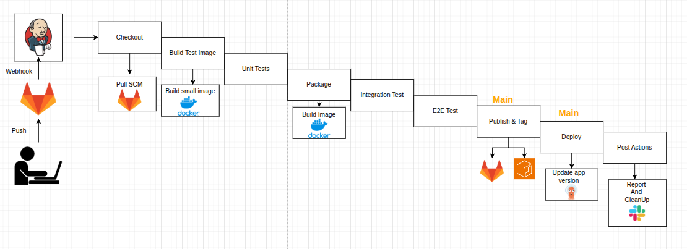
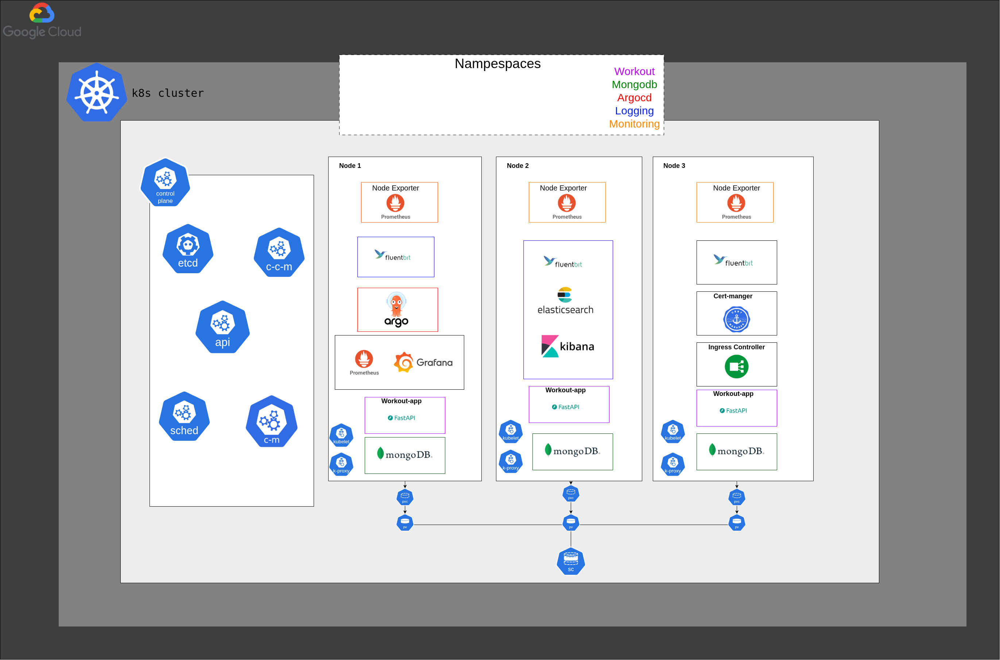
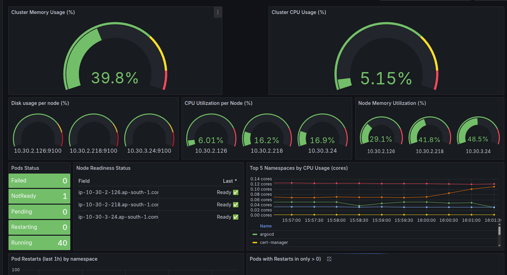
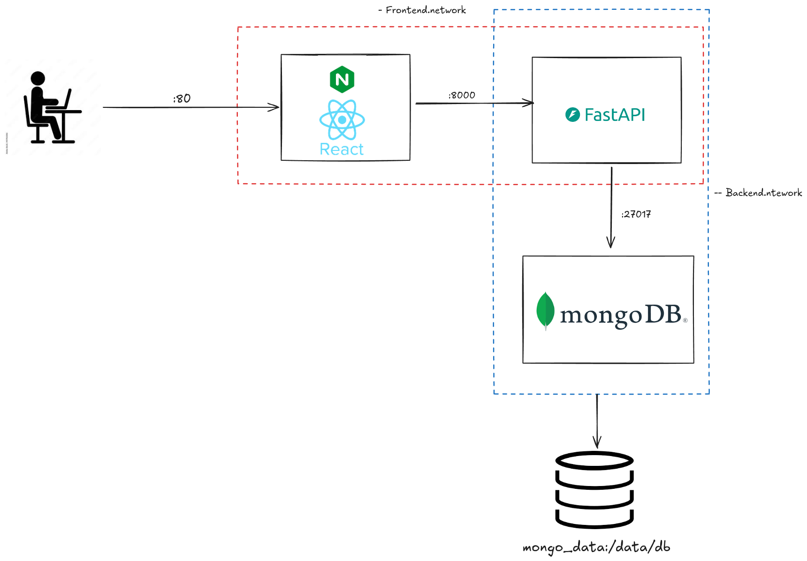
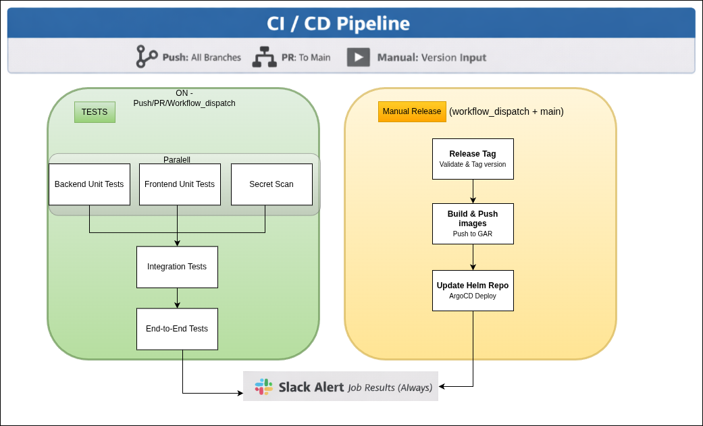
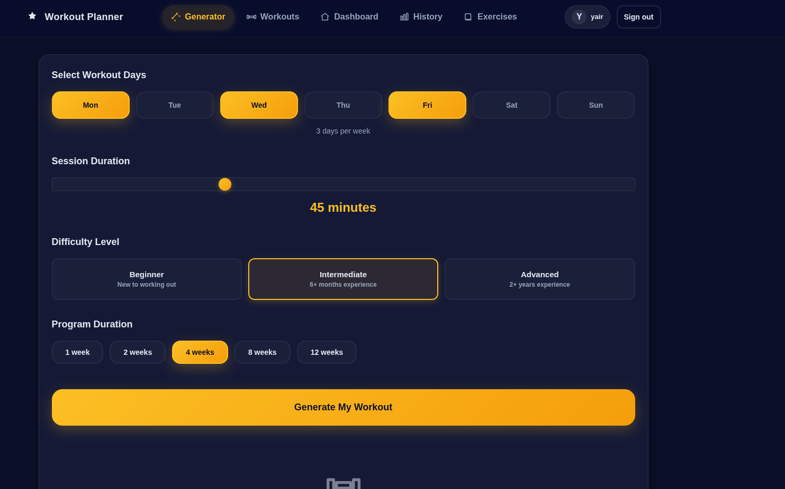
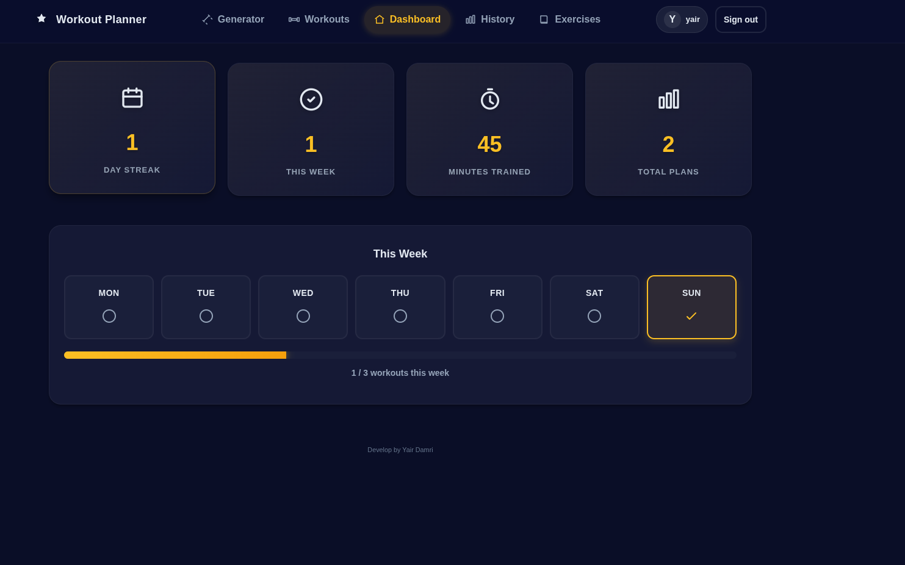

# Workout Generator & Tracker Portfolio

Full-stack fitness platform demonstrating application delivery, GitOps, and infrastructure automation.

## Quick Links

- Backend FastAPI app -> `app/`
- Frontend React app -> `frontend/`
- GitHub Actions workflows -> `.github/workflows/`
- Terraform (GCP) -> `infra-gcp/`
- Terragrunt live configs -> `infra-gcp/live/`
- Helm charts for Kubernetes -> `k8s/`
- ArgoCD GitOps definitions -> `argocd/`
- Test and automation scripts -> `scripts/`, `tests/`
- Diagrams and screenshots -> `images/`

## Overview

The system generates personalized workout plans, tracks training history, and surfaces live metrics. It pairs a FastAPI backend and React frontend with MongoDB, packaged for local Docker Compose, CI/CD via GitHub Actions, image publishing to GCP Artifact Registry (GAR), GitOps releases through ArgoCD, and GKE managed with Terraform in `infra-gcp/`.

<!-- Legacy note: `Jenkinsfile` and some diagrams are kept for reference from the earlier AWS/EKS version. -->

## Architectures
## End-to-end view of app tiers, CI/CD, GitOps, and cloud resources.


## GCP services used by the platform.


- External HTTP(S) Load Balancer: public entrypoint for the app
- GKE: runs the workloads
- Artifact Registry: stores container images
- Secret Manager: source of runtime secrets (via External Secrets)
- Cloud Storage: Terraform state
- Cloud Router + Cloud NAT: outbound internet access for private nodes
- Cloud Firewall Rules: network access control


<!-- 
Legacy AWS/Jenkins pipeline (kept for reference). -->
 ## GCP K8S Architecture


## Prometheus, Grafana, ELK, and alerting flows.


## Local development topology for backend, frontend, and MongoDB.



## Repository Map

| Area | Path | Highlights |
| --- | --- | --- |
| Backend API | `app/` | FastAPI, Pydantic models, workout planner, MongoDB access, structured logging |
| Frontend SPA | `frontend/` | React + Vite UI, auth flows, workout dashboards, NGINX reverse proxy |
| CI/CD | `.github/workflows/` | GitHub Actions pipeline for tests, release, publish, and deploy |
| Infrastructure as Code | `infra-gcp/` | Terraform modules for GCP VPC, GKE, IAM, Artifact Registry, and ArgoCD |
| Terragrunt live configs | `infra-gcp/live/` | Environment wiring for Terraform modules |
| Kubernetes Manifests | `k8s/` | Helm charts (`workout-stack`) |
| GitOps | `argocd/` | App-of-Apps parents, application sets, logging stack, SealedSecrets |
| Automation Scripts | `scripts/` | Integration and end-to-end flows against docker-compose stack |
| Testing | `tests/` | Pytest suite for planner/services logic |
| Visuals | `images/` | Architecture, pipeline, monitoring, and docker-compose diagrams |


## Component Highlights

### Backend (`app/`)
- Auth with PBKDF2 hashing and Mongo-backed sessions.
- Plan generation, workout completion logging, weekly summaries, and history filters.
- Request/response observability via `app/middleware.py` and business metrics logger.

### Frontend (`frontend/`)
- Hash-based routing, client-side auth persistence, workout creation and tracking UI.
- Shared JSON fetcher handles token management and error routing.
- Built with Vite, tested with Vitest, served behind NGINX proxy.

## Local Development

1. Copy `env-example` to `.env` and set `MONGO_URI`, `MONGO_DB_NAME`.
2. Start services: `docker compose up --build`.
3. Visit `http://localhost` for the SPA, `http://localhost/docs` for API docs, `http://localhost/health` for health checks.
4. Run unit tests: `docker build -f Dockerfile.test -t backend-test . && docker run --rm backend-test`.

## CI/CD (current)

- `.github/workflows/ci-cd.yaml` runs unit, integration, and e2e tests plus Gitleaks on every push.
- Manual releases use `workflow_dispatch` with a version tag, then build and push images to GAR and update the external Helm repo for ArgoCD to sync.


Visual breakdown of the CI/CD jobs and release flow.

## Kubernetes and GitOps

- Helm chart `k8s/charts/workout-stack` deploys backend, frontend, and Mongo dependencies with probes and resource settings.
- ArgoCD App-of-Apps (`argocd/*-parent.yaml`) syncs infrastructure, applications, and logging stacks with automated prune/self-heal.

## Infrastructure as Code

- `infra-gcp/` Terraform modules for VPC, GKE, IAM, Artifact Registry, and ArgoCD.
- `infra-gcp/live/` Terragrunt live environments that wire those modules together.

Terraform (module-only) flow:

```bash
cd infra-gcp/main
terraform init
terraform apply
gcloud container clusters get-credentials <cluster> --region <region> --project <project>
```

Terragrunt (live env) flow:

```bash
cd infra-gcp/live/prod
terragrunt run --all init
terragrunt run --all plan
terragrunt run --all apply
```

# Product Screens
## Configuring plan duration, days per week, and difficulty.


## Tracking active plans, history, and weekly stats.

